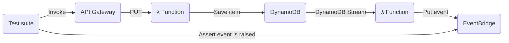

# Tools for running integration tests against ephemeral serverless stacks on AWS

This repository contains two parts; 
* One stack containing backend supporting infrastructure
* One lib containing a CLI tool for test stack setup and helper methods for test suite setup 

Please refer to their readmes for more information.

## Usage
The tool helps with setting up an ephemeral stack to run the tests against in an isolated manner. It's designed to let you test integrations _within one stack_ in the cloud.

To use in AWS CodeBuild, the buildspec.yml will look something like this

```
version: 0.2
phases:
  install:
    runtime-versions:
      nodejs: 14
    commands:
      - npm ci
      - npm install -g @mhlabs/serverless-testing-tool   # install CLI
  pre_build:
    commands:
      - export TEST_STACK_NAME=$(serverless-testing-tool get-stack-name)    # generate stack name based on git branch
      - sam deploy --stack-name ${TEST_STACK_NAME}                          # deploy ephemeral stack
      - export HTTP_MOCK_BASE_URL=$(serverless-testing-tool set-mock-url)   # If using http mocks, update Function's api base URL to point at mock API and return mock API URL
  build:
    commands:
      - npm run test    # Run tests
  post_build:
    commands:
      - sam delete --stack-name ${TEST_STACK_NAME} --no-prompts --region eu-west-1    # delete stack
```

The ephemeral stack only lived for the duration of the test suite.

## Mocking internal API calls
The ephemeral stack should be able to be tested in isolation and thus APIs it's calling might not exist.

Consider the following Lambda handler:
```
exports.handler = async function (event) {
	const userId = event.pathParameters.id;
	const attributes = JSON.parse(event.body).attributes;

	const user = await axios.get(`${process.env.ApiGatewayBaseUrl}/user/${userId}`);
	
    await dynamoDb.put({
		TableName: process.env.TableName,
		Item: {
			id: userId,
			name: user.data.FirstName,
			attributes: attributes
		}
	}).promise();

    return {
		statusCode: 200,
		body: "ok"
	}
};
```
Here, we want to test the integration to DynamoDB. The `user` API might not exist and even if it does we probably don't want to call the real thing, so we need to mock it.

When arranging our test case we'll set up the mock for that API call
```
await httpUtil.mock({
    uri: `/user/${id}`,
    response: {
        FirstName: "John"
    },
    duration: 50,
    status: 200,
    method: "get"
});
```

The arguments are quite self explanatory. Note that you can pass in duration for the mocked call. This lets you simulate added integration latency.

Note that the tool assumes that the function has an environment variable `ApiGatewayBaseUrl`. This can be overridden when calling `serverless-testing-tool set-mock-url`. See `serverless-testing-tool set-mock-url --help`

## Asserting EventBridgeEvents

Consider the following pattern



Our test will call the API gateway and assert that an event is put on EventBridge. For this we'll create super ephemeral resources that exist for a single test case. These are an EventBridge event rule and an SQS queue. 

Here's an example of how to create such subscription:
```
//Arrange
const id = new Date().getTime().toString();

const eventSubscriptionId = await events.subscribe("examplebus", {
    source: ["my-soucre],
    "detail-type": ["my detailtype"],
    detail: {
        data: {
            new: {
                id: [id],
            }
        }
    }
});
```

It's basically the name of an eventbus and an event pattern which you expect the emitted event to match.

In the assert stage of the test we'll wait for the event like this:
```
//Assert
const event = await events.waitForEvent(eventSubscriptionId);
expect(event.detail.data.new.id).toBe(id);
expect(event.detail.data.new.name).toBe("John");
expect(event.detail.data.new.attributes.age).toBe(25);
```

After each test, please clean up the EventBridge rule and SQS queue:
```
afterAll(async () => await events.cleanUp());
```

If forgotten, these will be removed automatically after 60min
